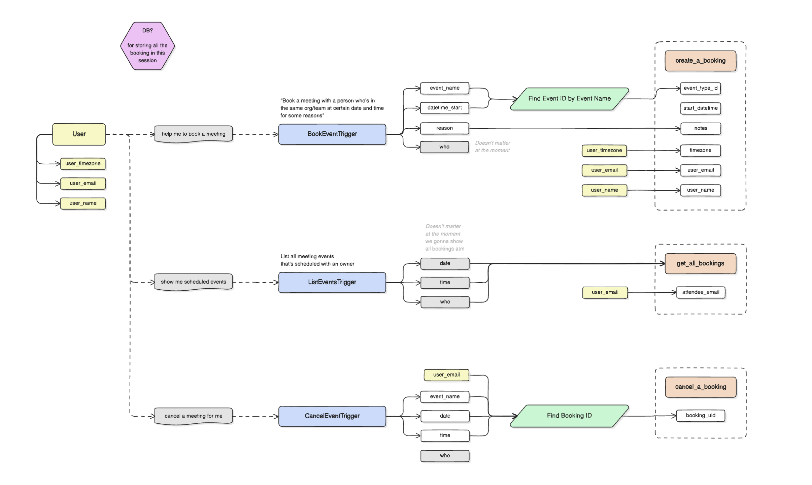

# CalCom AI Agent

> **Note**: This project is based on a product engineer take-home assignment.

An intelligent AI agent that integrates with Cal.com to manage your calendar and bookings. This agent can help you book meetings, list upcoming events, and cancel bookings using natural language.

## Demo


Check out the [demo video](./demo.mov) to see the agent in action!

## Overview

This project demonstrates an AI-powered assistant that leverages the Cal.com API to provide conversational calendar management. The agent understands user requests and takes appropriate actions like scheduling meetings, checking availability, and managing existing bookings.

## Getting started

### Project Structure

```shell
.
├── README.md
├── .gitignore
├── docker-compose.yml
├── demo.mov # demo video that shows all the functionalities required
├── backend
│   ├── .dockerignore
│   ├── API.md
│   ├── Dockerfile
│   ├── cal.py
│   ├── experiments
│   ├── main.py
│   ├── requirements.txt
│   ├── system_prompt.txt
│   ├── tools
│   └── utils
├── frontend
│   ├── .dockerignore
│   ├── .gitignore
│   ├── Dockerfile
│   ├── README.md
│   ├── eslint.config.mjs
│   ├── next.config.ts
│   ├── package-lock.json
│   ├── package.json
│   ├── postcss.config.mjs
│   ├── public
│   ├── src
│   └── tsconfig.json
```

### Key Features

- **Natural Language Scheduling**: Request meetings in plain English
- **Real-time Availability**: Check event type availability and book at specific times
- **Booking Management**: List all upcoming bookings and cancel meetings as needed
- **Multi-timezone Support**: Handle bookings across different timezones
- **AI-Powered**: Uses OpenAI GPT to understand and process user requests intelligently


### Running the App

Create a `.env` file in the `backend/` directory with the following variables:

```bash
OPENAI_API_KEY_LIVEXAI=your_openai_api_key_here
CALCOM_API_KEY=your_calcom_api_key_here
```

#### Using Docker Compose (Recommended)

```bash
# Build and start both services
docker compose up --build
# Run in detached mode
docker compose up -d --build
# Stop all services
docker compose down
# Monitor the log
docker compose logs --tail=10
```

- Frontend is reachable via `http://localhost:3021`
- Backend is reachable via `http://localhost:3020`

#### Development
For development, you can still use the original commands:
```bash
# Backend
cd backend && python -m pip install -r requirements.txt && python main.py

# Frontend  
cd front && npm install && npm run dev
```

## Design

This agent is built with a modular architecture:

- **Backend**: Python-based service that handles Cal.com API integration and AI agent logic
- **Frontend**: Next.js web interface for interacting with the agent
- **AI Layer**: OpenAI GPT integration with function calling to execute calendar actions

### How It Works

1. User enters a request (e.g., "Book a 30-minute meeting tomorrow at 2 PM")
2. The AI agent parses the request and identifies required actions
3. The backend makes API calls to Cal.com to check availability and create bookings
4. Results are returned to the frontend and displayed to the user



### Terminology

- **Event types**: refers to the templates for the meetings user offers. Each event type defines its own duration, availability, and booking rules.
- **Calendars**: refers to the external (outside) calendars.
- **Bookings**: refers to individual appointments/meetings based on an **event type** and is saved to a **calendar**

### Actions via Cal.com API

The agent supports three main calendar operations:

1. **Create Booking**: Schedule new meetings using available event types
2. **List Bookings**: Retrieve all upcoming valid bookings for a user
3. **Cancel Booking**: Cancel specific meetings

All interactions are handled through the Cal.com API with intelligent function calling powered by OpenAI.

#### References

- [Cal.com API Documentation](https://cal.com/docs/api-reference/v2/)
- [Cal.com MCP Server Reference](https://github.com/Danielpeter-99/calcom-mcp/)

### Cal.com API Class

> Disclaimer: the following API docs is generated using Claude Sonnet.

#### Initialization

```python
cal_tool = CalComTool(api_key="your_cal_api_key")
```

**Constructor Parameters:**

- `api_key` (required): Your Cal.com API key for authentication

The class automatically validates the API key on instantiation and sets up default configurations including:

- API endpoint prefix: `https://api.cal.com/v2/`
- Default API version: `2024-06-14`
- User configuration for demo purposes

#### Core API Methods

**Event Type Management:**

- `get_all_event_types()` - Retrieve all event types for the user
- `create_an_event_type(length_in_minutes, title, slug)` - Create a new event type
- `get_an_event_type(event_type_id)` - Get details of a specific event type

**Booking Management:**

- `get_available_time_slots(event_type_id, start, end)` - Get available time slots for an event type
- `create_a_booking(start_datetime, event_type_id, name, email, time_zone, notes)` - Create a new booking
- `get_all_bookings(attendee_email, status)` - Retrieve all bookings for a user
- `cancel_a_booking(booking_uid)` - Cancel a specific booking

**Profile Management:**

- `get_my_profile()` - Get the authenticated user's profile information

#### Function Calling Interface

The class provides three main function calling methods designed for AI agent integration:

**1. Create Booking**

```python
create_a_cal_booking(event_name, datetime_start, timezone, reason, user_email, user_name)
```

- Finds event types by fuzzy name matching
- Checks availability for the requested time slot
- Creates booking if exact time match is found
- Returns structured response with success/error codes

**2. List Bookings**

```python
list_all_cal_bookings(user_email)
```

- Retrieves all upcoming bookings for a user
- Returns formatted booking information including UID, title, times, and attendees
- Handles empty results gracefully

**3. Cancel Booking**

```python
cancel_user_booking(user_email, booking_name, datetime_start)
```

- Finds booking by exact name and datetime matching
- Cancels the booking using the Cal.com API
- Provides detailed success/failure feedback

#### Response Format

All function calling methods return a standardized response format:

```python
{
    "status": "success" | "error",
    "result": {
        "code": "specific_result_code",
        "message": "human_readable_message",
        "data": {...}  # relevant data
    }
}
```

#### Error Handling

The class implements comprehensive error handling including:

- API request failures with retry logic
- Rate limiting protection with delays
- Validation of response formats
- Detailed error reporting with specific error codes
- Graceful handling of edge cases (no matches, empty results, etc.)

#### Usage Example

```python
# Initialize the tool
cal_tool = CalComTool(api_key="your_api_key")

# Create a booking
result = cal_tool.create_a_cal_booking(
    event_name="30 Minute Meeting",
    datetime_start="2025-08-03T10:00:00.000-07:00",
    timezone="America/Los_Angeles",
    reason="Project discussion",
    user_email="user@example.com",
    user_name="John Doe"
)

# List user's bookings
bookings = cal_tool.list_all_cal_bookings("user@example.com")

# Cancel a booking
cancellation = cal_tool.cancel_user_booking(
    user_email="user@example.com",
    booking_name="30 Minute Meeting",
    datetime_start="2025-08-03T10:00:00.000-07:00"
)
```

